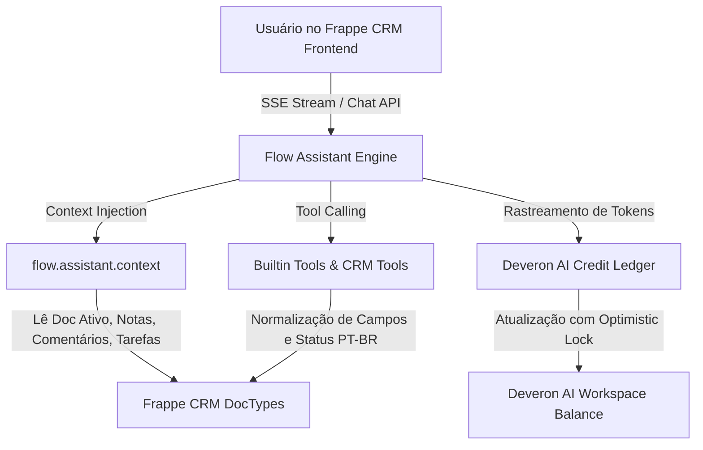

# Copilot CRM (Deveron Flow) — Guia de Contexto & Diretivas do Projeto

Este arquivo é a fonte primária de contexto, arquitetura, histórico de alterações e diretivas de desenvolvimento para agentes de IA (Google Antigravity / Gemini) e desenvolvedores trabalhando no repositório **`copilot_crm`** da **Deveron**.

---

## 1. Visão Geral do Projeto

- **Nome do Projeto:** Copilot CRM (baseado no app `flow` do ecossistema Frappe).
- **Organização:** Deveron (`deveron.com.br`).
- **Objetivo:** Copiloto inteligente integrado diretamente ao **Frappe CRM**, auxiliando vendedores e gestores a consultar registros, executar ações rápidas (criar leads, agendar tarefas, registrar notas, adicionar comentários na timeline do CRM, registrar ligações) e acompanhar métricas de vendas via linguagem natural (com foco em Português - PT-BR).
- **Mecanismo de Créditos:** Sistema multitenant próprio de consumo e auditoria de tokens/créditos de IA (`Deveron AI Credit Ledger` + `Deveron AI Workspace Balance`).

---

## 2. Ambientes de Desenvolvimento e Sincronização

O desenvolvimento opera em dois ambientes integrados que **precisam estar sempre sincronizados**:

| Ambiente | Caminho / Host | Descrição |
|---|---|---|
| **Workspace Windows** | `c:\Users\berna\repos\copilot_crm` | Repositório Git de origem (`origin/main`). Edições de código principais. |
| **Runtime Bench (WSL)** | `\\wsl.localhost\Ubuntu\home\bernardo\frappe\my-bench\apps\flow`<br>*(No WSL: `/home/bernardo/frappe/my-bench/apps/flow`)* | Instalação real do app no Frappe Bench onde o servidor roda. |
| **Site Frappe** | `deveron.localhost` | Site ativo no Bench do Frappe. |
| **Python no WSL** | `/home/bernardo/frappe/my-bench/env/bin/python` | Python venv com Frappe e apps instalados. |

### Regra Crítica de Sincronização
Ao modificar qualquer arquivo no repositório Windows, o arquivo correspondente no WSL deve ser atualizado (ou via Git pull/push, ou via cópia de arquivo no WSL).

Comando rápido para espelhar arquivos alterados para o WSL:
```bash
wsl -e bash -c "cp -r /mnt/c/Users/berna/repos/copilot_crm/* /home/bernardo/frappe/my-bench/apps/flow/"
```

### Limpeza de Cache e Migração no Bench
Após alterar doctypes, hooks ou tools do backend:
```bash
# Limpar cache do site
wsl -e bash -c "cd /home/bernardo/frappe/my-bench/sites && ../env/bin/python -m frappe.utils.bench_helper frappe --site deveron.localhost clear-cache"

# Rodar migrações quando novos doctypes forem adicionados
wsl -e bash -c "cd /home/bernardo/frappe/my-bench/sites && ../env/bin/python -m frappe.utils.bench_helper frappe --site deveron.localhost migrate"
```

---

## 3. Arquitetura do Sistema



---

## 4. Histórico Completo de Alterações e Ajustes

### A. Normalização de Dados e Suporte a PT-BR (`flow/tools/builtins.py`)
- **Problema resolvido:** Consultas em português geravam erros de permissão ou campos inválidos (ex: `Contact.organization` não existe no Frappe CRM, o campo correto é `company_name`).
- **Solução implementada:**
  - Mapeamento inteligente de aliases nos filtros e projeções:
    - `Contact`: `organization` / `empresa` $\rightarrow$ `company_name`, `email` $\rightarrow$ `email_id`.
    - Fallback para `Dynamic Link` caso o contato esteja associado à organização via link dinâmico.
    - Projeção de retorno injeta os aliases para o LLM responder sem ruído.
  - Normalização automática de status (`LEAD_STATUS_MAP`, `DEAL_STATUS_MAP`, `TASK_STATUS_MAP`):
    - Tradução automática de status informados em português (ex: "Novo" $\rightarrow$ "New", "Qualificado" $\rightarrow$ "Qualified", "Perdido" $\rightarrow$ "Lost").
    - Aplicado em `read()`, `create()`, `update()` e `bulk_update_records()`.
  - Tratamento para criação de Leads: divisão automática de `lead_name` / `full_name` em `first_name` e `last_name` quando `first_name` é obrigatório.

### B. Ferramentas Nativas de CRM (`flow/tools/crm.py`)
- **Problema resolvido:** O agente criava `CRM Task` ou `FCRM Note` genéricos quando o usuário solicitava *"Adicione um comentário no lead"*.
- **Solução implementada:**
  - `add_crm_comment`: Adiciona comentários diretamente na timeline do documento CRM via API oficial (`crm.api.comment.add_comment` / `Comment`).
  - `add_crm_note`: Cria anotações estruturadas (`FCRM Note`) com `title` e `content` tratados.
  - `manage_crm_task`: Criação e atualização de tarefas com status e prioridades normatizadas.
  - Exposição de todas as ferramentas no `BUILTIN_TOOLS` e sincronização permanente com o banco via `sync_builtin_tools()` com `frappe.db.commit()`.

### C. Contexto do Registro Ativo (`flow/assistant/context.py`)
- **Problema resolvido:** `TypeError: 'NoneType' object is not subscriptable` quando notas com `content=None` eram recuperadas ao abrir a conversa.
- **Solução implementada:**
  - Acesso defensivo `(n.content or "").strip()[:200]`.
  - Formatação defensiva de data e título.
  - Inclusão dos últimos `Comment` e `FCRM Note` vinculados ao registro aberto na tela do vendedor, permitindo que perguntas como *"O que foi falado sobre ele?"* ou *"Adicione um comentário"* reconheçam o contexto imediatamente.

### D. Frontend & UI Meta (`frontend/src/lib/toolMeta.js` & `frontend/src/main.js`)
- Adicionados metadados visuais para as novas ferramentas:
  - `add_crm_comment`: *"Adicionando Comentário"* com ícone de mensagem e formatação do registro referenciado.
  - `add_crm_note`: *"Criando Nota"*.
  - `manage_crm_task`: *"Gerenciando Tarefas"*.
- Tratamento de reconexão e destravamento de sessões com falha (`recover_session`).

### E. Módulo de Créditos de IA (`flow/ledger/` & DocTypes)
- **DocTypes Criados:**
  - `Deveron AI Credit Ledger`: Livro-razão imutável de transações (entradas de recarga, saídas por consumo de tokens prompt/completion, modelo utilizado, sessão, usuário e workspace).
  - `Deveron AI Workspace Balance`: Saldo consolidado por workspace/empresa com controle de concorrência (`modified` timestamp check).
  - `Copilot AI Settings`: Configurações globais de precificação de tokens e créditos padrão para novos workspaces.
- **Testes Unitários:** `flow/tests/test_ai_credit_ledger.py` cobrindo adição de créditos, débito concorrente e validação de saldo insuficiente.

---

## 5. Diretivas para o Agente de IA

Ao atuar neste projeto, siga estritamente estas diretivas:

1. **Princípio do Menor Esforço (Ponytail / YAGNI):**
   - Não invente bibliotecas ou abstrações desnecessárias. Use a biblioteca padrão do Python e as APIs nativas do Frappe Framework (`frappe.get_doc`, `frappe.get_all`, `frappe.db`).
   - Mantenha funções diretas, pequenas e com tratamento defensivo de campos `None`.

2. **Frappe Database Commits:**
   - Em scripts standalone, tarefas de background ou testes que alterem o banco via Python, o Frappe **não executa auto-commit**. Sempre use `frappe.db.commit()` quando persistir alterações via script ou console.

3. **Recuperação de Sessões Travadas:**
   - Se o SSE streaming interromper abruptamente, a `Flow Session` pode ficar travada com status `Running`. Use:
     ```python
     from flow.api.api import recover_session
     recover_session(session_id)
     ```

4. **Tratamento de I18N / Português:**
   - O usuário interage em Português. Sempre certifique-se de que termos de negócio do CRM (ex: "Oportunidade" $\leftrightarrow$ `CRM Deal`, "Lead" $\leftrightarrow$ `CRM Lead`, "Contato" $\leftrightarrow$ `Contact`, "Novo" $\leftrightarrow$ `New`, "Ganho" $\leftrightarrow$ `Won`) sejam transparentemente mapeados pelas ferramentas de backend.

5. **Integridade de Documentação:**
   - Mantenha este arquivo `AGENTS.md` atualizado sempre que um novo DocType, ferramenta (`tool`) ou ajuste arquitetural for implementado.
