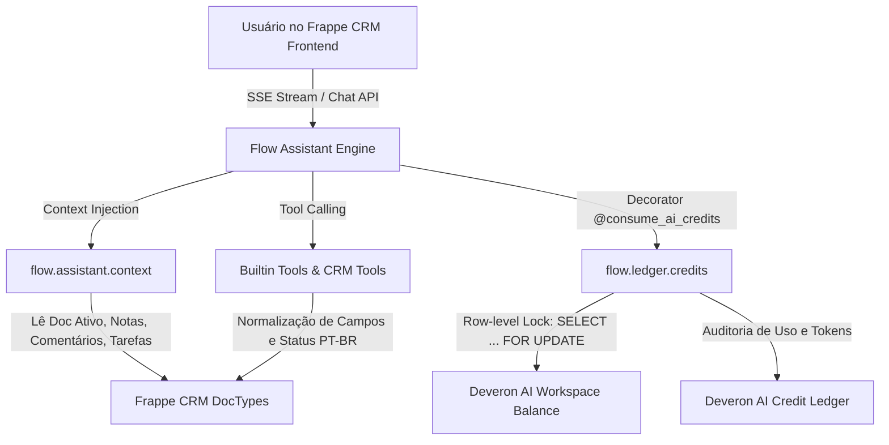

# Copilot CRM (Deveron Flow) — Guia de Contexto & Diretivas do Projeto

Este arquivo é a fonte primária de contexto, arquitetura, histórico de alterações e diretivas de desenvolvimento para agentes de IA (Google Antigravity / Gemini) e desenvolvedores trabalhando no repositório **`copilot_crm`** da **Deveron**.

---

## 1. Visão Geral do Projeto

- **Nome do Projeto:** Copilot CRM (baseado no app `flow` do ecossistema Frappe).
- **Organização:** Deveron (`deveron.com.br`).
- **Objetivo:** Copiloto inteligente integrado diretamente ao **Frappe CRM**, auxiliando vendedores e gestores a consultar registros, executar ações rápidas (criar leads, agendar tarefas, registrar notas, adicionar comentários na timeline do CRM, registrar ligações) e acompanhar métricas de vendas via linguagem natural (com foco em Português - PT-BR).
- **Mecanismo de Créditos:** Sistema multitenant próprio de consumo e auditoria de tokens/créditos de IA (`Deveron AI Credit Ledger` + `Deveron AI Workspace Balance`).

---

## 2. Ambientes de Desenvolvimento e Sincronização

O desenvolvimento opera em dois ambientes integrados que **precisam estar sempre sincronizados**:

| Ambiente | Caminho / Host | Descrição |
|---|---|---|
| **Workspace Windows** | `c:\Users\berna\repos\copilot_crm` | Repositório Git de origem (`origin/main`). Edições de código principais. |
| **Runtime Bench (WSL)** | `\\wsl.localhost\Ubuntu\home\bernardo\frappe\my-bench\apps\flow`<br>*(No WSL: `/home/bernardo/frappe/my-bench/apps/flow`)* | Instalação real do app no Frappe Bench onde o servidor roda. |
| **Site Frappe** | `deveron.localhost` | Site ativo no Bench do Frappe. |
| **Python no WSL** | `/home/bernardo/frappe/my-bench/env/bin/python` | Python venv com Frappe e apps instalados. |

### Regra Crítica de Sincronização
Ao modificar qualquer arquivo no repositório Windows, o arquivo correspondente no WSL deve ser atualizado (ou via Git pull/push, ou via cópia de arquivo no WSL).

Comando rápido para espelhar arquivos alterados para o WSL:
```bash
wsl -e bash -c "cp -r /mnt/c/Users/berna/repos/copilot_crm/* /home/bernardo/frappe/my-bench/apps/flow/"
```

### Limpeza de Cache e Migração no Bench
Após alterar doctypes, hooks ou tools do backend:
```bash
# Limpar cache do site
wsl -e bash -c "cd /home/bernardo/frappe/my-bench/sites && ../env/bin/python -m frappe.utils.bench_helper frappe --site deveron.localhost clear-cache"

# Rodar migrações quando novos doctypes forem adicionados
wsl -e bash -c "cd /home/bernardo/frappe/my-bench/sites && ../env/bin/python -m frappe.utils.bench_helper frappe --site deveron.localhost migrate"

# Executar testes unitários do ledger
wsl -e bash -c "cd /home/bernardo/frappe/my-bench && bench --site deveron.localhost run-tests --module flow.tests.test_ai_credit_ledger"
```

---

## 3. Arquitetura do Sistema e Divisão de Responsabilidades



### Divisão Copilot vs CRM (Usage-Based Metering):
- **No Copilot (`copilot_crm` / `flow`)**:
  - Camada técnica e de governança de custos de IA (*Circuit-Breaker & Metering*).
  - Decorator `@consume_ai_credits(cost=X)`.
  - Controle atômico no banco e bloqueio estrito em caso de saldo zerado.
  - Registro de auditoria (`Deveron AI Credit Ledger`).
- **No CRM (Negócio / Faturamento Comercial)**:
  - Gestão de contratos, planos (Starter, Pro, Enterprise) e faturamento por cadeira.
  - Na contratação ou renovação de ciclo, o CRM chama a API do Copilot para recarregar o workspace:
    ```python
    from flow.ledger import recharge_workspace_credits
    recharge_workspace_credits(workspace=company.workspace_id, amount=5000.0)
    ```

---

## 4. Histórico Completo de Alterações e Ajustes

### A. Normalização de Dados e Suporte a PT-BR (`flow/tools/builtins.py`)
- **Problema resolvido:** Consultas em português geravam erros de permissão ou campos inválidos (ex: `Contact.organization` não existe no Frappe CRM, o campo correto é `company_name`).
- **Solução implementada:**
  - Mapeamento inteligente de aliases nos filtros e projeções:
    - `Contact`: `organization` / `empresa` $\rightarrow$ `company_name`, `email` $\rightarrow$ `email_id`.
    - Fallback para `Dynamic Link` caso o contato esteja associado à organização via link dinâmico.
    - Projeção de retorno injeta os aliases para o LLM responder sem ruído.
  - Normalização automática de status (`LEAD_STATUS_MAP`, `DEAL_STATUS_MAP`, `TASK_STATUS_MAP`):
    - Tradução automática de status informados em português (ex: "Novo" $\rightarrow$ "New", "Qualificado" $\rightarrow$ "Qualified", "Perdido" $\rightarrow$ "Lost").
    - Aplicado em `read()`, `create()`, `update()` e `bulk_update_records()`.
  - Tratamento para criação de Leads: divisão automática de `lead_name` / `full_name` em `first_name` e `last_name` quando `first_name` é obrigatório.

### B. Ferramentas Nativas de CRM (`flow/tools/crm.py`)
- **Problema resolvido:** O agente criava `CRM Task` ou `FCRM Note` genéricos quando o usuário solicitava *"Adicione um comentário no lead"*.
- **Solução implementada:**
  - `add_crm_comment`: Adiciona comentários diretamente na timeline do documento CRM via API oficial (`crm.api.comment.add_comment` / `Comment`).
  - `add_crm_note`: Cria anotações estruturadas (`FCRM Note`) com `title` e `content` tratados.
  - `manage_crm_task`: Criação e atualização de tarefas com status e prioridades normatizadas.
  - Exposição de todas as ferramentas no `BUILTIN_TOOLS` e sincronização permanente com o banco via `sync_builtin_tools()` com `frappe.db.commit()`.

### C. Contexto do Registro Ativo (`flow/assistant/context.py`)
- **Problema resolvido:** `TypeError: 'NoneType' object is not subscriptable` quando notas com `content=None` eram recuperadas ao abrir a conversa.
- **Solução implementada:**
  - Acesso defensivo `(n.content or "").strip()[:200]`.
  - Formatação defensiva de data e título.
  - Inclusão dos últimos `Comment` e `FCRM Note` vinculados ao registro aberto na tela do vendedor, permitindo que perguntas como *"O que foi falado sobre ele?"* ou *"Adicione um comentário"* reconheçam o contexto imediatamente.

### D. Frontend & UI Meta (`frontend/src/lib/toolMeta.js` & `frontend/src/main.js`)
- Adicionados metadados visuais para as novas ferramentas:
  - `add_crm_comment`: *"Adicionando Comentário"* com ícone de mensagem e formatação do registro referenciado.
  - `add_crm_note`: *"Criando Nota"*.
  - `manage_crm_task`: *"Gerenciando Tarefas"*.
- Tratamento de reconexão e destravamento de sessões com falha (`recover_session`).

### E. Módulo de Créditos de IA e Faturamento por Cadeira (Feature 4.2)
- **DocTypes Criados:**
  - `Deveron AI Credit Ledger` (`flow/flow/doctype/deveron_ai_credit_ledger/`):
    - Tabela de auditoria imutável com campos: `user` (cadeira), `workspace` (pool compartilhado), `posting_datetime`, `feature`, `credits` (delta), `balance_after` (saldo da cadeira), `workspace_balance_after` (saldo do workspace), `tokens_prompt`, `tokens_completion`, referências de sessão e execução.
  - `Deveron AI Workspace Balance` (`flow/flow/doctype/deveron_ai_workspace_balance/`):
    - Registro de saldo compartilhado por workspace (`credit_balance`, `total_consumed`, `status`, `last_recharge`, `last_deduction`).
  - `Copilot AI Settings` (`flow/flow/doctype/copilot_ai_settings/`):
    - Configurações globais: `default_workspace_credits` (1000.0), `workspace_credit_balance`, `cost_per_chat`, `cost_per_tool`, `cost_per_rag`, `cost_per_proposal`.
- **Motor de Dedução Atômica (`flow/ledger/credits.py`):**
  - **Dedução atômica via Row-Level Lock:** `SELECT ... FOR UPDATE` no registro de `Deveron AI Workspace Balance` previne condições de corrida e saldos negativos sob concorrência.
  - **Bloqueio em Saldo Zero:** Se `credit_balance <= 0` ou `credit_balance < cost`, interrompe com `frappe.PermissionError`.
  - **Commit Imediato:** `frappe.db.commit()` é disparado logo após a dedução para liberar travas no banco antes de chamadas de LLM lentas.
  - **Estorno Automático (`refund_credits_atomically`):** Se a chamada externa do provedor de IA falhar com exceção, os créditos debitados são automaticamente devolvidos ao saldo do workspace.
  - **Decorator Flexível `@consume_ai_credits`:**
    - Suporta `@consume_ai_credits(cost=2.0)`
    - Suporta `@consume_ai_credits(cost=1.5, feature="rag")`
    - Suporta `@consume_ai_credits(feature="chat")` (retrocompatibilidade)
    - Suporta custos dinâmicos via callable e resolução de `workspace`.
- **Suíte de Testes:**
  - `flow/tests/test_ai_credit_ledger.py` (7/7 testes aprovados cobrindo inicialização, dedução atômica, bloqueio em saldo zero, decorators, estorno e recargas).

### F. Pipeline Assíncrono de Enriquecimento (Scout + Crawl4AI) — Task 5.1
- **Mecanismo:** Enriquecimento assíncrono disparado no hook `after_insert` de `CRM Lead` ou sob demanda (`enrich_lead`).
- **Campos adicionados ao CRM Lead (`crm_lead.json`):**
  - `tax_id` (CNPJ), `legal_name` (Razão Social), `cnae_code`, `cnae_description`, `company_size`, `shareholders` (QSA em JSON), `scraped_summary` (resumo web), `icp_score` (percentual calculado), `enrichment_status` (`Pending`, `Processing`, `Completed`, `Failed`).
- **Sidecar Clients & Fallbacks:**
  - `scout_client.py`: Consulta o endpoint Scout (`SCOUT_URL` ou `frappe.conf.scout_url`) com fallback defensivo para BrasilAPI pública (`https://brasilapi.com.br/api/cnpj/v1/{cnpj}`).
  - `crawl_client.py`: Consulta o endpoint Crawl4AI (`CRAWL4AI_URL` ou `frappe.conf.crawl4ai_url`) com fallback defensivo HTTP nativo e detecção heurística de palavras-chave B2B.
- **Orquestração & Faturamento (`crm/crm/enrichment/pipeline.py`):**
  - Orquestra consulta CNPJ, scraping web, cálculo heurístico de `icp_score` (base 50 + bônus porte + bônus B2B) e notificação WebSocket em tempo real (`crm_lead_updated`).
  - Utiliza `@consume_ai_credits(cost=1, operation_type="Lead Enrichment")` via módulo ponte `crm/crm/utils/ai_billing.py` integrado ao `Deveron AI Credit Ledger`.
- **Testes Unitários:**
  - `crm/crm/enrichment/tests/test_enrichment.py` (6/6 testes aprovados cobrindo sanitização, mocks de clientes, fluxo completo com auditoria de crédito e hook `after_insert`).

### G. Automação Autônoma do Kanban com CrewAI — Task 5.2
- **Mecanismo:** Rotina agendada (Cron `*/30 * * * *` em `scheduler_events`) onde um agente supervisor (`DealEvaluator`) audita a inatividade das negociações ativas via `Communication` / `creation`, calcula o `Deal Health Score` e realiza transições autônomas para cards estagnados.
- **Campos adicionados ao CRM Deal (`crm_deal.json`):**
  - `health_score` (Percent: 0–100%), `health_status` (`Good`, `Warning`, `Critical`), `stagnation_days` (Int: dias sem interação), `last_autonomous_action` (Datetime).
- **DocType CRM Note criado (`crm_note.json`):**
  - Registra notas explicativas auditáveis e sincroniza com `FCRM Note` para visibilidade instantânea na Activity Timeline nativa do Frappe CRM.
- **Agente Avaliador & Supervisor (`crm/crm/agents/deal_evaluator.py` & `crm/crm/tasks/kanban_supervisor.py`):**
  - Regra de Estagnação: Se `days_inactive >= 14` e `deal.status != "Esfriou"`, move o deal para `"Esfriou"`, define `health_status = "Critical"` e `health_score = 20`, e insere uma `CRM Note` auditável explicitando a regra aplicada.
  - Para negociações ativas recentes, calcula dinamicamente o `health_score` (Good/Warning) e atualiza `stagnation_days`.
- **Frontend Kanban (`Deals.vue`):**
  - Adicionado badge visual customizado com cores semânticas (`Good` $\rightarrow$ Verde, `Warning` $\rightarrow$ Âmbar, `Critical` $\rightarrow$ Vermelho) na exibição de cards do Kanban.
- **Testes Unitários:**
### H. Agente SDR por Voz em Tempo Real (Pipecat) — Task 5.3
- **Mecanismo:** Pipeline full-duplex de voz em tempo real executando em container dedicado (`deveron-voice-sdr`) conectando Twilio Media Streams ao Pipecat com latência inferior a 1s:
  - `Twilio Transport -> Deepgram STT (nova-2 pt-BR) -> LLM Worker (SDR Qualification) -> Cartesia TTS (Sonic pt-BR) -> Twilio Audio Out`.
  - Ao concluir a ligação, a LLM consolida a transcrição e resumo estruturado, disparando um webhook POST assinado com HMAC-SHA256 para o CRM.
- **Campos adicionados ao CRM Call Log (`crm_call_log.json` & `crm_call_log.py`):**
  - `summary` (Small Text: resumo da qualificação), `transcript` (Long Text: transcrição integral da chamada), `reference_name` (Data: vínculo com o CRM Lead).
  - Normalização flexível de `caller` e `receiver` para suportar tanto links de `User` quanto identificadores de telefonia / Caller IDs alfanuméricos (`"SDR Autônomo Deveron"`, números E.164).
- **Módulo de Faturamento e Auditoria (`flow/flow/doctype/deveron_ai_credit_ledger/`):**
  - Adicionado suporte a `credits_debited`, `credits_credited`, `reference_doctype`, `reference_name` e feature `Voice SDR`.
  - Regra de Faturamento: débito proporcional à duração da chamada a uma taxa de 10 créditos por minuto (`minutes = max(1, int(duration / 60))`).
  - Sincronização automática do saldo compartilhado no `Deveron AI Workspace Balance` mesmo quando inserido diretamente via `frappe.get_doc({...}).insert()`.
- **Webhook de Ingestão (`crm/crm/integrations/voice_sdr.py`):**
  - Endpoint `@frappe.whitelist(allow_guest=True) receive_sdr_call_result()` que persiste o `CRM Call Log`, atualiza o `CRM Lead.status` para `"Qualificado"` (quando aplicável) e registra o débito correspondente no `Deveron AI Credit Ledger`.
- **Sidecar Pipecat (`deveron-voice-sdr/`):**
  - `bot.py`: Aplicação FastAPI WebSocket com pipeline streaming Pipecat, suporte a chamadas TwiML (`POST /twiml`), streaming de áudio bidirecional (`/ws/voice`), extração de `CallResultPayload` e webhook dispatcher para o CRM com modo mock automático para ambientes de teste.
  - `Dockerfile`, `requirements.txt`, `.env.example`.
- **Testes Automatizados:**
  - `crm/crm/integrations/tests/test_voice_sdr.py` (4/4 testes aprovados cobrindo fluxo completo, chamada sub-minuto, validação de payload/assinatura e snippets de inserção direta do CRM Call Log e Credit Ledger).

---


## 5. Diretivas para o Agente de IA

Ao atuar neste projeto, siga estritamente estas diretivas:

1. **Princípio do Menor Esforço (Ponytail / YAGNI):**
   - Não invente bibliotecas ou abstrações desnecessárias. Use a biblioteca padrão do Python e as APIs nativas do Frappe Framework (`frappe.get_doc`, `frappe.get_all`, `frappe.db`).
   - Mantenha funções diretas, pequenas e com tratamento defensivo de campos `None`.

2. **Frappe Database Commits:**
   - Em scripts standalone, tarefas de background ou testes que alterem o banco via Python, o Frappe **não executa auto-commit**. Sempre use `frappe.db.commit()` quando persistir alterações via script ou console.

3. **Recuperação de Sessões Travadas:**
   - Se o SSE streaming interromper abruptamente, a `Flow Session` pode ficar travada com status `Running`. Use:
     ```python
     from flow.api.api import recover_session
     recover_session(session_id)
     ```

4. **Tratamento de I18N / Português:**
   - O usuário interage em Português. Sempre certifique-se de que termos de negócio do CRM (ex: "Oportunidade" $\leftrightarrow$ `CRM Deal`, "Lead" $\leftrightarrow$ `CRM Lead`, "Contato" $\leftrightarrow$ `Contact`, "Novo" $\leftrightarrow$ `New`, "Ganho" $\leftrightarrow$ `Won`) sejam transparentemente mapeados pelas ferramentas de backend.

5. **Sincronização Obrigatória com WSL:**
   - Sempre que arquivos forem criados ou alterados no repositório Windows (`c:\Users\berna\repos\copilot_crm`), garanta que o espelhamento para `\\wsl.localhost\Ubuntu\home\bernardo\frappe\my-bench\apps\flow` seja realizado e, se houver alteração de DocTypes ou DB, rode `bench migrate` e `clear-cache`.

6. **Integridade de Documentação:**
   - Mantenha este arquivo `AGENTS.md` atualizado sempre que um novo DocType, ferramenta (`tool`) ou ajuste arquitetural for implementado.
