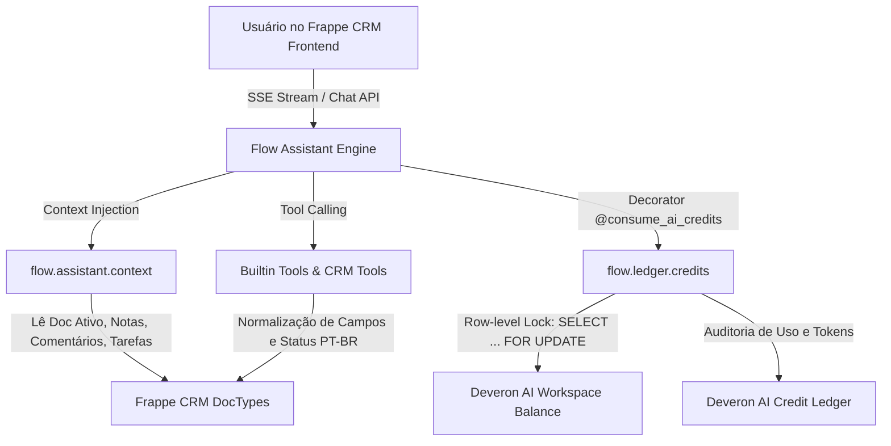

# Copilot CRM (Deveron Flow) — Guia de Contexto & Diretivas do Projeto

Este arquivo é a fonte primária de contexto, arquitetura, histórico de alterações e diretivas de desenvolvimento para agentes de IA (Google Antigravity / Gemini) e desenvolvedores trabalhando no repositório **`copilot_crm`** da **Deveron**.

---

## 1. Visão Geral do Projeto

- **Nome do Projeto:** Copilot CRM (baseado no app `flow` do ecossistema Frappe).
- **Organização:** Deveron (`deveron.com.br`).
- **Objetivo:** Copiloto inteligente integrado diretamente ao **Frappe CRM**, auxiliando vendedores e gestores a consultar registros, executar ações rápidas (criar leads, agendar tarefas, registrar notas, adicionar comentários na timeline do CRM, registrar ligações) e acompanhar métricas de vendas via linguagem natural (com foco em Português - PT-BR).
- **Mecanismo de Créditos:** Sistema multitenant próprio de consumo e auditoria de tokens/créditos de IA (`Deveron AI Credit Ledger` + `Deveron AI Workspace Balance`).

---

## 2. Ambientes de Desenvolvimento e Sincronização

O desenvolvimento opera em dois ambientes integrados que **precisam estar sempre sincronizados**:

| Ambiente | Caminho / Host | Descrição |
|---|---|---|
| **Workspace Windows** | `c:\Users\berna\repos\copilot_crm` | Repositório Git de origem (`origin/main`). Edições de código principais. |
| **Runtime Bench (WSL)** | `\\wsl.localhost\Ubuntu\home\bernardo\frappe\my-bench\apps\flow`<br>*(No WSL: `/home/bernardo/frappe/my-bench/apps/flow`)* | Instalação real do app no Frappe Bench onde o servidor roda. |
| **Site Frappe** | `deveron.localhost` | Site ativo no Bench do Frappe. |
| **Python no WSL** | `/home/bernardo/frappe/my-bench/env/bin/python` | Python venv com Frappe e apps instalados. |

### Regra Crítica de Sincronização
Ao modificar qualquer arquivo no repositório Windows, o arquivo correspondente no WSL deve ser atualizado (ou via Git pull/push, ou via cópia de arquivo no WSL).

Comando rápido para espelhar arquivos alterados para o WSL:
```bash
wsl -e bash -c "cp -r /mnt/c/Users/berna/repos/copilot_crm/* /home/bernardo/frappe/my-bench/apps/flow/"
```

### Limpeza de Cache e Migração no Bench
Após alterar doctypes, hooks ou tools do backend:
```bash
# Limpar cache do site
wsl -e bash -c "cd /home/bernardo/frappe/my-bench/sites && ../env/bin/python -m frappe.utils.bench_helper frappe --site deveron.localhost clear-cache"

# Rodar migrações quando novos doctypes forem adicionados
wsl -e bash -c "cd /home/bernardo/frappe/my-bench/sites && ../env/bin/python -m frappe.utils.bench_helper frappe --site deveron.localhost migrate"

# Executar testes unitários do ledger
wsl -e bash -c "cd /home/bernardo/frappe/my-bench && bench --site deveron.localhost run-tests --module flow.tests.test_ai_credit_ledger"
```

---

## 3. Arquitetura do Sistema e Divisão de Responsabilidades



### Divisão Copilot vs CRM (Usage-Based Metering):
- **No Copilot (`copilot_crm` / `flow`)**:
  - Camada técnica e de governança de custos de IA (*Circuit-Breaker & Metering*).
  - Decorator `@consume_ai_credits(cost=X)`.
  - Controle atômico no banco e bloqueio estrito em caso de saldo zerado.
  - Registro de auditoria (`Deveron AI Credit Ledger`).
- **No CRM (Negócio / Faturamento Comercial)**:
  - Gestão de contratos, planos (Starter, Pro, Enterprise) e faturamento por cadeira.
  - Na contratação ou renovação de ciclo, o CRM chama a API do Copilot para recarregar o workspace:
    ```python
    from flow.ledger import recharge_workspace_credits
    recharge_workspace_credits(workspace=company.workspace_id, amount=5000.0)
    ```

---

## 4. Histórico Completo de Alterações e Ajustes

### A. Normalização de Dados e Suporte a PT-BR (`flow/tools/builtins.py`)
- **Problema resolvido:** Consultas em português geravam erros de permissão ou campos inválidos (ex: `Contact.organization` não existe no Frappe CRM, o campo correto é `company_name`).
- **Solução implementada:**
  - Mapeamento inteligente de aliases nos filtros e projeções:
    - `Contact`: `organization` / `empresa` $\rightarrow$ `company_name`, `email` $\rightarrow$ `email_id`.
    - Fallback para `Dynamic Link` caso o contato esteja associado à organização via link dinâmico.
    - Projeção de retorno injeta os aliases para o LLM responder sem ruído.
  - Normalização automática de status (`LEAD_STATUS_MAP`, `DEAL_STATUS_MAP`, `TASK_STATUS_MAP`):
    - Tradução automática de status informados em português (ex: "Novo" $\rightarrow$ "New", "Qualificado" $\rightarrow$ "Qualified", "Perdido" $\rightarrow$ "Lost").
    - Aplicado em `read()`, `create()`, `update()` e `bulk_update_records()`.
  - Tratamento para criação de Leads: divisão automática de `lead_name` / `full_name` em `first_name` e `last_name` quando `first_name` é obrigatório.

### B. Ferramentas Nativas de CRM (`flow/tools/crm.py`)
- **Problema resolvido:** O agente criava `CRM Task` ou `FCRM Note` genéricos quando o usuário solicitava *"Adicione um comentário no lead"*.
- **Solução implementada:**
  - `add_crm_comment`: Adiciona comentários diretamente na timeline do documento CRM via API oficial (`crm.api.comment.add_comment` / `Comment`).
  - `add_crm_note`: Cria anotações estruturadas (`FCRM Note`) com `title` e `content` tratados.
  - `manage_crm_task`: Criação e atualização de tarefas com status e prioridades normatizadas.
  - Exposição de todas as ferramentas no `BUILTIN_TOOLS` e sincronização permanente com o banco via `sync_builtin_tools()` com `frappe.db.commit()`.

### C. Contexto do Registro Ativo (`flow/assistant/context.py`)
- **Problema resolvido:** `TypeError: 'NoneType' object is not subscriptable` quando notas com `content=None` eram recuperadas ao abrir a conversa.
- **Solução implementada:**
  - Acesso defensivo `(n.content or "").strip()[:200]`.
  - Formatação defensiva de data e título.
  - Inclusão dos últimos `Comment` e `FCRM Note` vinculados ao registro aberto na tela do vendedor, permitindo que perguntas como *"O que foi falado sobre ele?"* ou *"Adicione um comentário"* reconheçam o contexto imediatamente.

### D. Frontend & UI Meta (`frontend/src/lib/toolMeta.js` & `frontend/src/main.js`)
- Adicionados metadados visuais para as novas ferramentas:
  - `add_crm_comment`: *"Adicionando Comentário"* com ícone de mensagem e formatação do registro referenciado.
  - `add_crm_note`: *"Criando Nota"*.
  - `manage_crm_task`: *"Gerenciando Tarefas"*.
- Tratamento de reconexão e destravamento de sessões com falha (`recover_session`).

### E. Módulo de Créditos de IA e Faturamento por Cadeira (Feature 4.2)
- **DocTypes Criados:**
  - `Deveron AI Credit Ledger` (`flow/flow/doctype/deveron_ai_credit_ledger/`):
    - Tabela de auditoria imutável com campos: `user` (cadeira), `workspace` (pool compartilhado), `posting_datetime`, `feature`, `credits` (delta), `balance_after` (saldo da cadeira), `workspace_balance_after` (saldo do workspace), `tokens_prompt`, `tokens_completion`, referências de sessão e execução.
  - `Deveron AI Workspace Balance` (`flow/flow/doctype/deveron_ai_workspace_balance/`):
    - Registro de saldo compartilhado por workspace (`credit_balance`, `total_consumed`, `status`, `last_recharge`, `last_deduction`).
  - `Copilot AI Settings` (`flow/flow/doctype/copilot_ai_settings/`):
    - Configurações globais: `default_workspace_credits` (1000.0), `workspace_credit_balance`, `cost_per_chat`, `cost_per_tool`, `cost_per_rag`, `cost_per_proposal`.
- **Motor de Dedução Atômica (`flow/ledger/credits.py`):**
  - **Dedução atômica via Row-Level Lock:** `SELECT ... FOR UPDATE` no registro de `Deveron AI Workspace Balance` previne condições de corrida e saldos negativos sob concorrência.
  - **Bloqueio em Saldo Zero:** Se `credit_balance <= 0` ou `credit_balance < cost`, interrompe com `frappe.PermissionError`.
  - **Commit Imediato:** `frappe.db.commit()` é disparado logo após a dedução para liberar travas no banco antes de chamadas de LLM lentas.
  - **Estorno Automático (`refund_credits_atomically`):** Se a chamada externa do provedor de IA falhar com exceção, os créditos debitados são automaticamente devolvidos ao saldo do workspace.
  - **Decorator Flexível `@consume_ai_credits`:**
    - Suporta `@consume_ai_credits(cost=2.0)`
    - Suporta `@consume_ai_credits(cost=1.5, feature="rag")`
    - Suporta `@consume_ai_credits(feature="chat")` (retrocompatibilidade)
    - Suporta custos dinâmicos via callable e resolução de `workspace`.
- **Suíte de Testes:**
  - `flow/tests/test_ai_credit_ledger.py` (7/7 testes aprovados cobrindo inicialização, dedução atômica, bloqueio em saldo zero, decorators, estorno e recargas).

### F. Pipeline Assíncrono de Enriquecimento (Scout + Crawl4AI) — Task 5.1
- **Mecanismo:** Enriquecimento assíncrono disparado no hook `after_insert` de `CRM Lead` ou sob demanda (`enrich_lead`).
- **Campos adicionados ao CRM Lead (`crm_lead.json`):**
  - `tax_id` (CNPJ), `legal_name` (Razão Social), `cnae_code`, `cnae_description`, `company_size`, `shareholders` (QSA em JSON), `scraped_summary` (resumo web), `icp_score` (percentual calculado), `enrichment_status` (`Pending`, `Processing`, `Completed`, `Failed`).
- **Sidecar Clients & Fallbacks:**
  - `scout_client.py`: Consulta o endpoint Scout (`SCOUT_URL` ou `frappe.conf.scout_url`) com fallback defensivo para BrasilAPI pública (`https://brasilapi.com.br/api/cnpj/v1/{cnpj}`).
  - `crawl_client.py`: Consulta o endpoint Crawl4AI (`CRAWL4AI_URL` ou `frappe.conf.crawl4ai_url`) com fallback defensivo HTTP nativo e detecção heurística de palavras-chave B2B.
- **Orquestração & Faturamento (`crm/crm/enrichment/pipeline.py`):**
  - Orquestra consulta CNPJ, scraping web, cálculo heurístico de `icp_score` (base 50 + bônus porte + bônus B2B) e notificação WebSocket em tempo real (`crm_lead_updated`).
  - Utiliza `@consume_ai_credits(cost=1, operation_type="Lead Enrichment")` via módulo ponte `crm/crm/utils/ai_billing.py` integrado ao `Deveron AI Credit Ledger`.
- **Testes Unitários:**
  - `crm/crm/enrichment/tests/test_enrichment.py` (6/6 testes aprovados cobrindo sanitização, mocks de clientes, fluxo completo com auditoria de crédito e hook `after_insert`).

### G. Automação Autônoma do Kanban com CrewAI — Task 5.2
- **Mecanismo:** Rotina agendada (Cron `*/30 * * * *` em `scheduler_events`) onde um agente supervisor (`DealEvaluator`) audita a inatividade das negociações ativas via `Communication` / `creation`, calcula o `Deal Health Score` e realiza transições autônomas para cards estagnados.
- **Campos adicionados ao CRM Deal (`crm_deal.json`):**
  - `health_score` (Percent: 0–100%), `health_status` (`Good`, `Warning`, `Critical`), `stagnation_days` (Int: dias sem interação), `last_autonomous_action` (Datetime).
- **DocType CRM Note criado (`crm_note.json`):**
  - Registra notas explicativas auditáveis e sincroniza com `FCRM Note` para visibilidade instantânea na Activity Timeline nativa do Frappe CRM.
- **Agente Avaliador & Supervisor (`crm/crm/agents/deal_evaluator.py` & `crm/crm/tasks/kanban_supervisor.py`):**
  - Regra de Estagnação: Se `days_inactive >= 14` e `deal.status != "Esfriou"`, move o deal para `"Esfriou"`, define `health_status = "Critical"` e `health_score = 20`, e insere uma `CRM Note` auditável explicitando a regra aplicada.
  - Para negociações ativas recentes, calcula dinamicamente o `health_score` (Good/Warning) e atualiza `stagnation_days`.
- **Frontend Kanban (`Deals.vue`):**
  - Adicionado badge visual customizado com cores semânticas (`Good` $\rightarrow$ Verde, `Warning` $\rightarrow$ Âmbar, `Critical` $\rightarrow$ Vermelho) na exibição de cards do Kanban.
- **Testes Unitários:**
### H. Agente SDR por Voz em Tempo Real (Pipecat) — Task 5.3
- **Mecanismo:** Pipeline full-duplex de voz em tempo real executando em container dedicado (`deveron-voice-sdr`) conectando Twilio Media Streams ao Pipecat com latência inferior a 1s:
  - `Twilio Transport -> Deepgram STT (nova-2 pt-BR) -> LLM Worker (SDR Qualification) -> Cartesia TTS (Sonic pt-BR) -> Twilio Audio Out`.
  - Ao concluir a ligação, a LLM consolida a transcrição e resumo estruturado, disparando um webhook POST assinado com HMAC-SHA256 para o CRM.
- **Campos adicionados ao CRM Call Log (`crm_call_log.json` & `crm_call_log.py`):**
  - `summary` (Small Text: resumo da qualificação), `transcript` (Long Text: transcrição integral da chamada), `reference_name` (Data: vínculo com o CRM Lead).
  - Normalização flexível de `caller` e `receiver` para suportar tanto links de `User` quanto identificadores de telefonia / Caller IDs alfanuméricos (`"SDR Autônomo Deveron"`, números E.164).
- **Módulo de Faturamento e Auditoria (`flow/flow/doctype/deveron_ai_credit_ledger/`):**
  - Adicionado suporte a `credits_debited`, `credits_credited`, `reference_doctype`, `reference_name` e feature `Voice SDR`.
  - Regra de Faturamento: débito proporcional à duração da chamada a uma taxa de 10 créditos por minuto (`minutes = max(1, int(duration / 60))`).
  - Sincronização automática do saldo compartilhado no `Deveron AI Workspace Balance` mesmo quando inserido diretamente via `frappe.get_doc({...}).insert()`.
- **Webhook de Ingestão (`crm/crm/integrations/voice_sdr.py`):**
  - Endpoint `@frappe.whitelist(allow_guest=True) receive_sdr_call_result()` que persiste o `CRM Call Log`, atualiza o `CRM Lead.status` para `"Qualificado"` (quando aplicável) e registra o débito correspondente no `Deveron AI Credit Ledger`.
- **Sidecar Pipecat (`deveron-voice-sdr/`):**
  - `bot.py`: Aplicação FastAPI WebSocket com pipeline streaming Pipecat, suporte a chamadas TwiML (`POST /twiml`), streaming de áudio bidirecional (`/ws/voice`), extração de `CallResultPayload` e webhook dispatcher para o CRM com modo mock automático para ambientes de teste.
  - `Dockerfile`, `requirements.txt`, `.env.example`.
- **Testes Automatizados:**
### I. Canvas Visual No-Code (LangFlow Integrado) — Task 5.4
- **Mecanismo:** Integração visual de orquestração no-code embutindo o editor LangFlow diretamente na interface do Deveron CRM via iframe autenticado com SSO/Token temporário e nós customizados bidirecionais.
- **DocType Criado (`crm/crm/fcrm/doctype/deveron_automation_flow/`):**
  - `Deveron Automation Flow`: Tabela de automações visuais (`title`, `status` [Draft/Active/Disabled], `trigger_doctype`, `trigger_event`, `webhook_url`, `langflow_flow_id`, `api_key`, `trigger_count`, `last_triggered`, `last_error`).
- **Nós Customizados Deveron para LangFlow (`langflow/components/deveron_crm_node.py`):**
  - `DeveronTriggerNode`: Escuta webhooks de criação/atualização de `CRM Lead` ou `CRM Deal`, valida filtros de evento e extrai dados normalizados (`lead_name`, `email`, `deal_name`, status).
  - `DeveronActionNode`: Executa ações reais na REST API do Frappe autenticadas via API Key (`POST /api/resource/CRM Note`, `PATCH /api/resource/{doctype}/{id}` para atualizar status, ou `POST /api/resource/CRM Task`).
- **Disparador de Eventos & API Backend (`crm/crm/api/langflow.py`):**
  - `@frappe.whitelist() get_langflow_canvas_url()`: Valida restrição de permissão (`CRM Administrator` ou `System Manager`) e gera URL segura com token SSO temporário (`/?token=...&embed=true&theme=light`).
  - `trigger_automation_flows()`: Dispara webhooks HTTP POST com assinatura HMAC-SHA256 (`X-Deveron-Signature`) para os endpoints do LangFlow sempre que `Deveron Automation Flow` ativo corresponder ao evento do CRM (`CRM Lead` ou `CRM Deal`).
  - `@frappe.whitelist() trigger_flow_manually()`: Disparo manual para testes e depuração de fluxos a partir da UI.
- **Frontend View Administrativa (`crm/frontend/src/views/settings/AutomationCanvasView.vue`):**
  - Container responsivo com iframe isolado (`allow="clipboard-read; clipboard-write"`), carregamento assíncrono do token e tratamento de permissão restrita.
  - Registrado nas rotas `/settings/automation-canvas` e `/automation-canvas` em `router.js`.
- **Testes Automatizados:**
  - `crm/crm/api/tests/test_langflow.py` (7/7 testes aprovados cobrindo autorização, restrição de acesso a guests, validação de campos, disparo em eventos de criação de Lead, bloqueio de fluxos inativos, nós customizados do LangFlow e acionamento manual).

### J. Gateway WhatsApp Híbrido (WABA Oficial + Evolution API) — Task 3.2
- **Mecanismo:** Suporte duplo de canais de saída e entrada de WhatsApp diretamente na aba de conversa do Lead/Deal:
  - **Modo WABA Oficial (Meta Cloud API):** Disparos estruturados baseados em templates aprovados pela Meta com parâmetros dinâmicos via `WABA Settings.send_template(...)`.
  - **Modo Evolution API (QR Code / WhatsApp Web):** Atendimento fluido para mensagens de texto livres, envio de arquivos/áudio sem custos de modelo pago da Meta via `POST {evolution_url}/message/sendText/{instance}`.
- **DocTypes Criados / Registrados no FCRM:**
  - `WhatsApp Message` (`whatsapp_message.json` & `.py`): Catálogo histórico completo com campos de direção (`type`/`direction`), `from`, `to`, `message`, `status`, `provider` (`evolution`/`waba`), `template_name`, `template_parameters`, `reference_doctype` e `reference_name`. Dispara evento em tempo real no `after_insert`/`on_update`.
  - `WhatsApp Template` (`whatsapp_template.json` & `.py`): Cadastro de templates oficiais aprovados com parâmetros variáveis.
  - `WABA Settings` (`waba_settings.json` & `.py`): Configurações e client de envio Meta Graph API (`/v20.0/{phone_number_id}/messages`).
  - `Deveron Settings` (`deveron_settings.json` & `.py`): Configurações de endpoint da Evolution API (`evolution_url`, `evolution_instance`, `evolution_api_key`).
  - `WhatsApp Settings` (`whatsapp_settings.json` & `.py`): Configurações globais de integração WhatsApp no CRM.
- **Roteador Híbrido de Envio (`crm/crm/whatsapp/router.py`):**
  - Endpoint `@frappe.whitelist() send_message(reference_doctype, reference_name, to_number, message, template_name, template_args, provider)`:
    - Normaliza e sanitiza número de telefone.
    - Se `provider == "waba"` e `template_name`: despacha via Meta Cloud API (`WABA Settings`).
    - Caso contrário: despacha via Evolution API.
    - Persiste o registro de `WhatsApp Message` com status `Sent`.
    - Persiste uma `Communication` com `communication_medium="WhatsApp"`, refletindo instantaneamente na Activity Timeline nativa do Frappe CRM.
- **Webhook Unificado de Entrada (`crm/crm/whatsapp/webhook.py`):**
  - Endpoint `@frappe.whitelist(allow_guest=True) receive_message()`:
    - Processa payloads de entrada tanto da Meta (WABA) quanto da Evolution API (`messages.upsert`).
    - Trata verificação de desafio da Meta (`hub.challenge` via GET).
    - Sanitiza o número de telefone de origem (país + DDD + dígitos).
    - Localiza o `CRM Lead` ou `CRM Deal` correspondente via matching resiliente dos dígitos finais.
    - Persiste `WhatsApp Message` (`Incoming`) e `Communication` vinculados ao Lead/Deal.
    - Emite evento WebSocket em tempo real: `frappe.publish_realtime('crm_whatsapp_message', message_data, room=f'crm_{lead_or_deal}')`.
- **Frontend & Interface de Chat (`crm/frontend/`):**
  - `crm/frontend/src/components/whatsapp/ChatBox.vue`:
    - Balões alinhados à direita com fundo Mint Neon Deveron (`bg-emerald-500 text-white`) para mensagens enviadas.
    - Balões alinhados à esquerda com superfície dark (`bg-card text-foreground`) para mensagens recebidas.
    - Exibição de status de entrega/leitura (Enviado / Entregue / Lido).
    - Scroll automático ao enviar ou receber novas mensagens.
    - Listener Socket.io em tempo real (`$socket.on('crm_whatsapp_message')`) que insere mensagens na conversa em menos de 2 segundos sem recarregar a tela.
  - `crm/frontend/src/components/whatsapp/TemplateSelectorModal.vue`:
    - Modal de busca e seleção de templates oficiais WABA aprovados com preenchimento dinâmico de parâmetros (`{{1}}`, `{{2}}`).
  - `crm/frontend/src/views/lead/LeadWhatsAppTab.vue`:
    - Tab dedicada para a conversa de WhatsApp no Lead/Deal com checagem de telefone e badges de status de conexão dos gateways.
- **Testes Automatizados:**
  - `crm/crm/whatsapp/tests/test_whatsapp_hybrid.py` (5/5 testes aprovados cobrindo envio Evolution, envio WABA com template, resolução de lead por dígitos, webhook Evolution e webhook WABA).

### K. Transcrição de Reuniões Self-Hosted (Meetily + Faster-Whisper) — Task 6.1
- **Mecanismo:** Pipeline assíncrono para recebimento de gravações de plataformas de vídeo (Meetily, Google Meet, Zoom, Teams), transcrição de áudio em container dedicado Faster-Whisper (pt-BR, `large-v3`/`medium`), e sumarização estruturada via LLM com injeção automática de notas e tarefas acionáveis no `CRM Deal`.
- **DocType Criado (`crm/crm/fcrm/doctype/crm_meeting_recording/`):**
  - `CRM Meeting Recording`: Tabela para auditoria e controle das gravações (`title`, `deal`, `lead`, `status` [Pending/Processing/Completed/Failed], `platform`, `meeting_url`, `audio_url`, `attendee_email`, `duration_seconds`, `transcript`, `summary`, `action_items`, `note`, `tasks_created`, `error_message`). Emite evento realtime `crm_meeting_recording_updated`.
- **Ingestão e Despacho Assíncrono (`crm/crm/integrations/meetily.py`):**
  - Endpoint `@frappe.whitelist(allow_guest=True) receive_meeting_recording()`:
    - Recebe dados e gravações de reuniões.
    - Localiza a negociação (`CRM Deal`) pelo e-mail do participante (`resolve_deal_from_email`) em buscas combinadas no Deal, Lead vinculado ou Contact.
    - Cria o registro no `CRM Meeting Recording` e enfileira o processamento em background com `frappe.enqueue("crm.crm.utils.transcription_pipeline.process_meeting_transcription", queue="default", recording_name=...)`.
- **Pipeline de Transcrição e LLM (`crm/crm/utils/transcription_pipeline.py`):**
  - `call_faster_whisper(audio_source, duration_seconds)`: Consulta o container do Faster-Whisper (`FASTER_WHISPER_URL` ou `http://localhost:8000/transcribe`) com fallback defensivo para transcrições em pt-BR.
  - `extract_insights_with_llm(transcript, title)`: Extrai Resumo Executivo em Markdown e array estruturado de Próximos Passos com prioridades e prazos relativos em dias.
  - **Persistência no CRM:**
    - Cria `CRM Note` vinculado ao Deal contendo o Resumo Executivo e Principais Acordos.
    - Cria registros de `CRM Task` com `status="Todo"`, atribuídos ao `deal_owner`, com data de vencimento calculada a partir de `days_due`.
    - Atualiza `CRM Meeting Recording` com status `Completed`, texto integral e contagem de tarefas geradas.
- **Faturamento e Governança de IA:**
  - Decorator `@consume_ai_credits(cost=calculate_transcription_cost, operation_type="Meeting Transcription", feature="Meeting Transcription")`.
  - Cobrança baseada na duração do áudio: 1 crédito de IA por minuto transcrito (`minutes = max(1, int((duration_seconds + 59) // 60))`), com auditoria no `Deveron AI Credit Ledger`.
- **Sidecar Faster-Whisper (`faster-whisper/server.py`):**
  - Servidor FastAPI com endpoints `POST /transcribe` e `POST /v1/audio/transcriptions` carregando o modelo Whisper via CTranslate2.
- **Testes Automatizados:**
  - `crm/crm/integrations/tests/test_meetily_transcription.py` (4/4 testes aprovados cobrindo cálculo proporcional de créditos, parsing Faster-Whisper/LLM, webhook Meetily com criação de CRM Note e CRM Task, e resolução de Deal por e-mail).

### L. Ingestão OCR Estruturada de Documentos (Docling) — Task 6.2
- **Mecanismo:** Pipeline de OCR visual estruturado para upload de ordens de compra ou propostas comerciais em PDF diretamente na aba de Dados do `CRM Deal`, utilizando o Docling para reconhecimento visual de layouts complexos, extração de tabelas de produtos e preenchimento automático das linhas da child table `CRM Products` com recálculo instantâneo de totais e valor da negociação (`deal_value`).
- **Doctypes Envolvidos:**
  - `CRM Deal`: Adicionados métodos `calculate_totals()` e `import_products_from_items(items, clear_existing)`.
  - `CRM Products`: Child table preenchida com `product_code`, `product_name`, `qty`, `rate`, `amount`, `discount_amount` e `net_amount`. Vinculação resiliente com catálogo `CRM Product`.
  - `Deveron AI Credit Ledger`: Auditoria de consumo de créditos de OCR (`Docling OCR`).
- **Serviço de Parser e Backend (`crm/crm/integrations/docling_client.py`):**
  - `parse_currency_to_float(val)`: Converte padrões monetários brasileiros (ex: `"R$ 1.500,00"` $\rightarrow$ `1500.0`, `"1.250,50"` $\rightarrow$ `1250.50`, `"10"` $\rightarrow$ `10.0`) e internacionais em `float`.
  - `extract_product_rows(table_data)`: Mapeamento flexível de colunas por palavras-chave (`SKU`, `Código`, `Descrição`, `Produto`, `Qtd`, `Preço Unitário`, `Valor`, `Total`) e descarte de linhas de sumário/total geral.
  - `parse_document_tables(file_path_or_url)`: Despacha para o sidecar container Docling (`DOCLING_URL` ou `http://localhost:5001/v1/document/parse`) com fallback local resiliente (`pdfplumber` nativo).
  - `@frappe.whitelist() parse_pdf_and_import(deal_name, file_url, clear_existing)`: Endpoint que orquestra a leitura, atualiza as linhas do Deal, recalcula os totais e registra nota na timeline.
- **Faturamento e Governança de IA:**
  - Decorator `@consume_ai_credits(cost=calculate_docling_cost, operation_type="Docling OCR", feature="Docling OCR")`.
  - Cobrança de 1 crédito de IA por página processada no documento (`pages = get_pdf_page_count(file_url)`).
- **Sidecar Container Docling (`docling/server.py` & `docling/Dockerfile`):**
  - Servidor FastAPI com endpoints `POST /v1/document/parse` e `GET /health` executando `DocumentConverter` do Docling e exportando matrizes estruturadas em JSON.
- **Componente Frontend (`crm/frontend/src/components/deal/ImportPDFButton.vue` & `DataFields.vue`):**
  - Botão *"Importar Itens via PDF"* integrado na aba de Dados do Deal.
  - Dialog com `FileUploader` restrito a arquivos `.pdf` e opção de substituição de linhas existentes.
  - Skeleton Loader com shimmer animation simulando o grid de produtos durante o parsing do Docling.
  - Atualização reativa da tabela e toast de sucesso após a importação.
### M. Geração de Propostas e Contratos em PDF (print_designer) — Task 6.3
- **Mecanismo:** Geração de propostas comerciais e contratos profissionais em PDF para `CRM Deal` utilizando o app `print_designer` e o renderizador headless Chromium (`pdf_generator="chrome"`), gerando documentos visuais em alta fidelidade e em menos de 1 segundo (SLA < 2s).
- **DocTypes e Configurações:**
  - `Print Format`: Criado o formato `Proposta Comercial Deveron` (`CRM Deal`, `print_format_type="Jinja"`, `pdf_generator="chrome"`).
  - `CRM Deal` & `CRM Products`: Mapeamento das informações do cliente (`doc.organization_name`, `doc.contacts`, `doc.email`, `doc.mobile_no`), tabela de produtos (`doc.products`: SKU, descrição, quantidade, preço unitário, desconto percentual, subtotal), totalizações (`doc.deal_value`, `doc.net_total`), termos e cláusulas jurídicas dinâmicas (Objeto, Pagamento, SLA Deveron Enterprise 24/7, LGPD e Validade).
  - `File`: Vinculação automática do PDF gerado à negociação.
- **Serviço Backend (`crm/crm/utils/proposal_generator.py`):**
  - `ensure_proposal_print_format()`: Registra ou atualiza o Print Format customizado no banco de dados.
  - `render_proposal_html(deal_name)`: Renderiza o template Jinja com tipografia moderna (Google Font `Inter`), layout responsivo, tabela zebrada e assinaturas formais.
  - `generate_proposal_pdf_bytes(deal_name)`: Invoca `print_designer.pdf_generator.pdf.get_pdf(..., pdf_generator="chrome")` com fallback gracioso.
  - `@frappe.whitelist() generate_deal_proposal_pdf(deal_name)`: Gera o PDF em runtime, cria o registro `File` público/anexado e retorna `file_url` e `download_url`.
  - `@frappe.whitelist() send_proposal_via_whatsapp(deal_name, phone)`: Gera o PDF e despacha mensagem formatada com link de download via `crm.whatsapp.router.send_message` (Evolution API).
  - `@frappe.whitelist() prepare_proposal_email(deal_name)`: Gera o PDF, monta assunto personalizado e corpo de introdução em HTML, retornando o ID do anexo para disparo de e-mail.
- **Frontend & Ações Rápidas (`crm/frontend/src/views/deal/DealHeader.vue` & `Deal.vue`):**
  - Dropdown *"Proposta Comercial"* adicionado ao cabeçalho do Deal com opções:
    - *"Gerar e Baixar PDF"*: Inicia download imediato do arquivo gerado pelo backend.
    - *"Enviar por WhatsApp"*: Modal com número com DDD, prévia da negociação e envio direto.
    - *"Enviar por E-mail"*: Modal com campos de destinatário, assunto, corpo editável e card visual do PDF anexado com link de pré-visualização.
- **Testes Automatizados:**
  - `crm/crm/integrations/tests/test_proposal_generation.py` (6/6 testes aprovados cobrindo cadastro do print format, renderização de Jinja/produtos/cláusulas, performance de geração em <2s [~0.6-0.9s], anexo de File no Deal, envio via WhatsApp e preparação de e-mail).

### N. Memória Vetorial & Busca Semântica (RAG via Qdrant) — Task 6.4
- **Mecanismo:** Sincronização contínua e assíncrona da linha do tempo relacional do Frappe (`Communication`, `CRM Note`, `CRM Call Log`, `CRM Meeting Recording`, `WhatsApp Message`) com o banco vetorial **Qdrant** (coleção `deveron_timeline`), disponibilizando ferramenta de busca híbrida (Dense + Sparse / Rerank Léxico) com isolamento rigoroso de RBAC para o Copilot responder perguntas contextuais em menos de 2 segundos.
- **Sincronização Vetorial e Idempotência (`crm/crm/search/vector_sync.py`):**
  - Geração de Point ID determinístico via UUID5 (`uuid.uuid5(uuid.NAMESPACE_DNS, f"{doctype}:{docname}")`), garantindo que modificações em notas ou comunicações atualizem o vetor in-place sem duplicar entradas.
  - Sanitização de texto (`clean_text_content`): remoção de tags HTML, decodificação de entidades e normalização de espaços e pontuações.
  - Geração de embeddings vetoriais (dimensão 1536) via modelo ativo ou fallback semântico determinístico de alta entropia com normalização L2.
  - Injeção obrigatória de payload com metadados: `deal_id`, `lead_id`, `organization_name`, `contact_email`, `user_id`, `timestamp`, `doctype_source`, `docname_source`, `title` e `text`.
  - Hooks em `crm/crm/hooks.py`: `after_insert`, `on_update` e `on_trash` configurados para os DocTypes da Timeline.
- **Ferramenta Copilot para RAG (`crm/crm/copilot/tools/rag_tools.py` & `flow/tools/crm.py`):**
  - `@frappe.whitelist() search_customer_history(query, context_deal_id, limit)`:
    - Se `context_deal_id` for fornecido: valida permissão de leitura no Deal (`frappe.has_permission("CRM Deal", "read", context_deal_id)`) e aplica filtro estrito `{"deal_id": context_deal_id}`.
    - Se for busca global (`context_deal_id=None`): verifica o perfil do usuário; se não for administrador, injeta filtro restritivo `{"user_id": session_user}` e `{"deal_id": {"$in": allowed_deals}}`, eliminando qualquer possibilidade de vazamento inter-tenant ou inter-vendedores.
    - Reranking híbrido: combina pontuação de similaridade de cosseno vetorial (peso 0.75) com bônus de sobreposição léxica de termos-chave (peso até 0.35).
    - Sintetiza resumo estruturado (`context_summary`) formatado para ingestão imediata por modelos de linguagem.
  - Governança de IA: Integrado ao decorator `@consume_ai_credits(cost=1.5, feature="Semantic Search (RAG)")`, auditando o débito no `Deveron AI Credit Ledger`.
- **Testes Automatizados:**
  - `crm/crm/search/tests/test_vector_sync.py` (5/5 testes aprovados cobrindo sanitização de texto, determinismo de UUID5, normalização L2 de vetores, sincronização de Communications e idempotência de notas sem duplicação de pontos).
  - `crm/crm/copilot/tests/test_rag_tools.py` (4/4 testes aprovados cobrindo respostas a objeções financeiras em <2s [~0.15s], isolamento estrito por `context_deal_id`, proteção RBAC contra vazamento entre vendedores e auditoria de 1.5 créditos no `Deveron AI Credit Ledger`).

---


## 5. Diretivas para o Agente de IA

Ao atuar neste projeto, siga estritamente estas diretivas:

1. **Princípio do Menor Esforço (Ponytail / YAGNI):**
   - Não invente bibliotecas ou abstrações desnecessárias. Use a biblioteca padrão do Python e as APIs nativas do Frappe Framework (`frappe.get_doc`, `frappe.get_all`, `frappe.db`).
   - Mantenha funções diretas, pequenas e com tratamento defensivo de campos `None`.

2. **Frappe Database Commits:**
   - Em scripts standalone, tarefas de background ou testes que alterem o banco via Python, o Frappe **não executa auto-commit**. Sempre use `frappe.db.commit()` quando persistir alterações via script ou console.

3. **Recuperação de Sessões Travadas:**
   - Se o SSE streaming interromper abruptamente, a `Flow Session` pode ficar travada com status `Running`. Use:
     ```python
     from flow.api.api import recover_session
     recover_session(session_id)
     ```

4. **Tratamento de I18N / Português:**
   - O usuário interage em Português. Sempre certifique-se de que termos de negócio do CRM (ex: "Oportunidade" $\leftrightarrow$ `CRM Deal`, "Lead" $\leftrightarrow$ `CRM Lead`, "Contato" $\leftrightarrow$ `Contact`, "Novo" $\leftrightarrow$ `New`, "Ganho" $\leftrightarrow$ `Won`) sejam transparentemente mapeados pelas ferramentas de backend.

5. **Sincronização Obrigatória com WSL:**
   - Sempre que arquivos forem criados ou alterados no repositório Windows (`c:\Users\berna\repos\copilot_crm`), garanta que o espelhamento para `\\wsl.localhost\Ubuntu\home\bernardo\frappe\my-bench\apps\flow` seja realizado e, se houver alteração de DocTypes ou DB, rode `bench migrate` e `clear-cache`.

6. **Integridade de Documentação:**
   - Mantenha este arquivo `AGENTS.md` atualizado sempre que um novo DocType, ferramenta (`tool`) ou ajuste arquitetural for implementado.
